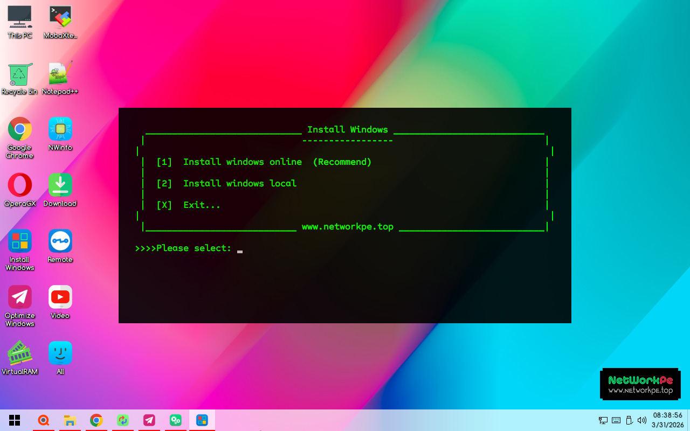
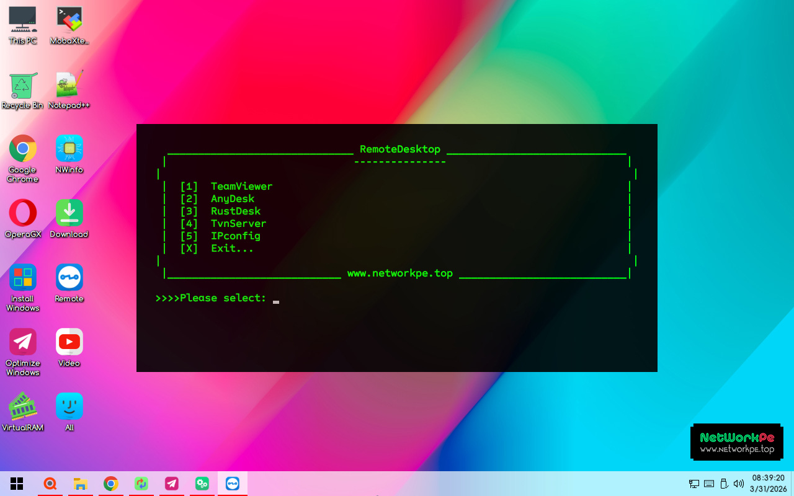
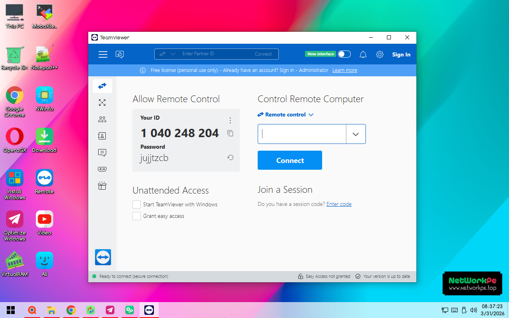

   NetworkPE-Document   

# NetworkPE\-Document

#### NetworkPE-v1.2-2026.4.10

NetworkPE is a WinPE with full network functionality. You can use for computer maintenance or as a portable RAMOS, It runs in RAM and is extremely fast.

